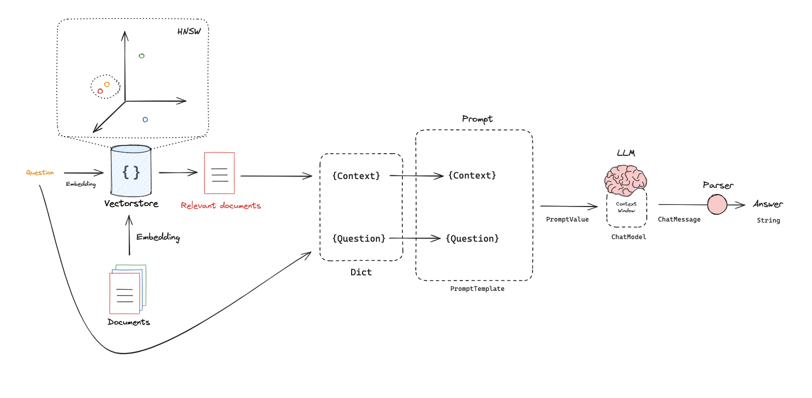
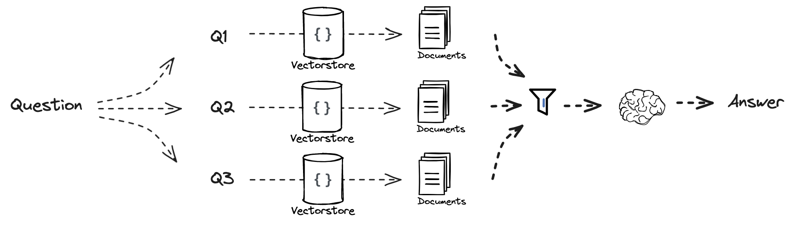
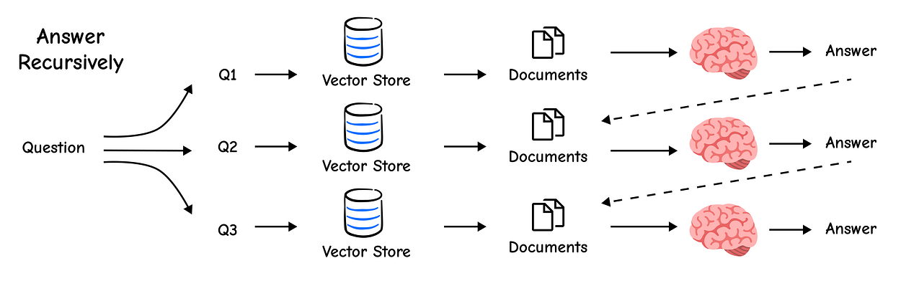
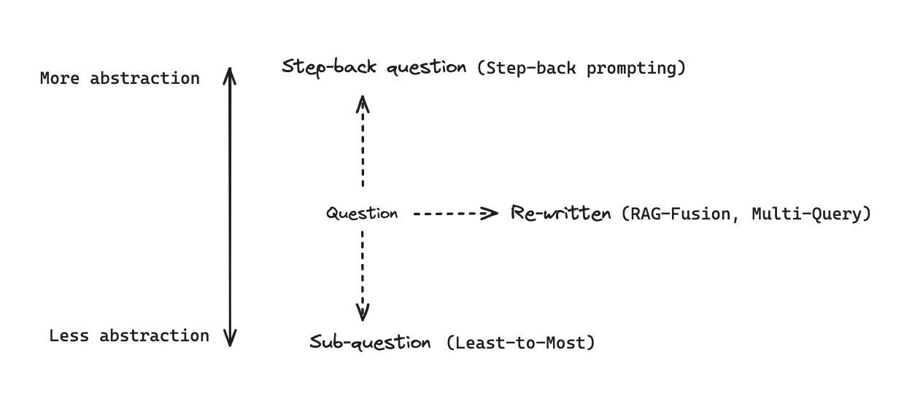
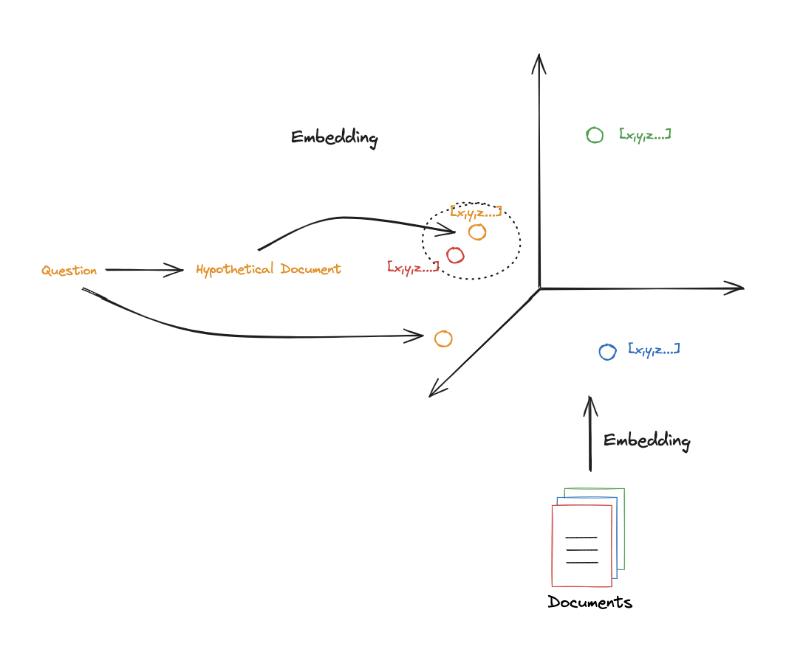
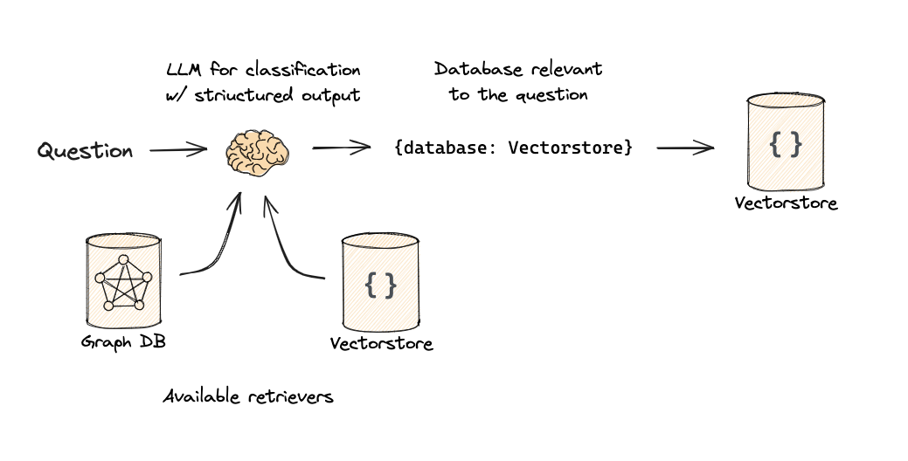

# rag-summary-and-practice
RAG 技术要点、本地实践

## 0.背景

最近几周工作上，接触些 RAG 内容，看了点资料；本着`最好的学习是复述`原则，把所有要点，重新梳理下。

思路：

1.RAG 解决什么问题？
2.RAG 核心原理、核心组件
3.RAG 高级技术，不同组件的高级用法
4.效果评估
5.后续发展方向

## 1.RAG 解决什么问题

LLM 基于大规模数据的预训练，获取的通用知识。对于`私有数据`和`高频更新数据`，LLM 无法及时更新。如果采用 `Fine-Tuning` 监督微调方式，LLM 训练成本也较高，而且无法解决`幻觉`问题。 

即，`私有数据`和`高频更新数据`，以及`幻觉`问题，LLM 模型自身解决成本较高，因此，引入 RAG `Retrieval Augmented Generation`。


## 2.核心原理

RAG 检索增强生成：通过检索`外部数据源`信息，构造`融合上下文`（Context），输入给 LLM，获取更准确的结果。

核心环节：

a. 索引（indexing）
b. 检索（retrieval）
c. 生成（generation）


下述 RAG 架构图中，出了上面 3 个核心环节，还有：查询优化、路由、查询构造

* 查询优化（Query Translation）：查询重写、查询扩展、预查伪文档；
* 路由（Routing）：根据查询，判断从哪些数据源，获取信息；
* 查询抽取（Query Construction）：从原始 Query 中，抽取 SQL、Cypher、metadatas，分别用于 关系数据库、图数据库、向量数据库的查询。


开始之前，先在本地安装好 Ollama，并且下载好 embedding model 和 language model。

* TODO：增加一个链接.

安装依赖：

* TODO 增加 python 依赖以及版本？

```
! pip install langchain_community tiktoken langchain-ollama langchainhub chromadb langchain
```

### 2.1. RAG Oveview

完整的 indexing、retrieval、generation 实例代码如下：

```
import bs4
from langchain import hub
from langchain.text_splitter import RecursiveCharacterTextSplitter
from langchain_community.document_loaders import WebBaseLoader
from langchain_community.vectorstores import Chroma
from langchain_core.output_parsers import StrOutputParser
from langchain_core.runnables import RunnablePassthrough
from langchain_ollama import OllamaLLM, OllamaEmbeddings

#### 1.INDEXING ####

# Load Documents
loader = WebBaseLoader(
    web_paths=("https://lilianweng.github.io/posts/2023-06-23-agent/",),
    bs_kwargs=dict(
        parse_only=bs4.SoupStrainer(
            class_=("post-content", "post-title", "post-header")
        )
    ),
)
docs = loader.load()

# Split
text_splitter = RecursiveCharacterTextSplitter(chunk_size=1000, chunk_overlap=200)
splits = text_splitter.split_documents(docs)

# Embed
vectorstore = Chroma.from_documents(
    documents=splits, 
    embedding=OllamaEmbeddings(model="nomic-embed-text"))

retriever = vectorstore.as_retriever()

#### 2.RETRIEVAL and 3.GENERATION ####

# Prompt
# Pull a pre-made RAG prompt from LangChain Hub
prompt = hub.pull("rlm/rag-prompt")
print(prompt)

# LLM
llm = OllamaLLM(model="deepseek-r1:8b")

# Post-processing
# Helper function to format retrieved documents
def format_docs(docs):
    return "\n\n".join(doc.page_content for doc in docs)

# Helper function to remove <think> part in the text
def remove_think_tags(text):
    """remove <think> part in the text"""
    cleaned_text = re.sub(r'<think>.*?</think>', '', text, flags=re.DOTALL)
    cleaned_text = re.sub(r'\n\s*\n', '\n', cleaned_text)
    return cleaned_text.strip()

# RAG Chain
rag_chain = (
    {"context": retriever | format_docs, "question": RunnablePassthrough()}
    | prompt
    | llm
    | StrOutputParser()
    # | remove_think_tags
)

# Question
# Ask a question using the RAG chain
response = rag_chain.invoke("What is Task Decomposition?")
print(response)
```

### 2.2. Indexing

几个方面：

1. Tokenizer：分词，文本会被拆分成 token，映射到词表中 tokenID。
2. Embedding：嵌入，将 tokenID 映射到向量空间中，得到 token 的向量表示。
3. Chunk：分块，将文本拆分成多个 chunk，每个 chunk 包含多个 token。
4. Index：索引，将 chunk 的向量表示存储到向量数据库中。

#### 2.2.1.Token

更多细节， [Count tokens](https://github.com/openai/openai-cookbook/blob/main/examples/How_to_count_tokens_with_tiktoken.ipynb) and [~4 char / token](https://help.openai.com/en/articles/4936856-what-are-tokens-and-how-to-count-them)

> TODO: token 的扩展信息，参考上面链接.

查看下面分词得到的 Token：

```
import tiktoken

# Documents
document = "My favorite pet is a cat."
question = "What kinds of pets do I like?"

# count token num
def num_tokens_from_string(string: str, encoding_name: str) -> int:
    """Returns the number of tokens in a text string."""
    encoding = tiktoken.get_encoding(encoding_name)
    tokenIDs = encoding.encode(string)

    print('tokenIDs: ' + str(tokenIDs))

    num_tokens = len(tokenIDs)
    return num_tokens

# use cl100k_base encoding
result = num_tokens_from_string(question, "cl100k_base")
print('token num: ' + str(result))
```

#### 2.2.2.Embedding

[Ollama Embedding](https://python.langchain.com/docs/integrations/text_embedding/ollama/) ，实例：

```
from langchain_ollama import OllamaEmbeddings

embd = OllamaEmbeddings(model="nomic-embed-text")
query_result = embd.embed_query(question)
document_result = embd.embed_query(document)
result = len(query_result)

print('query_result: ' + str(query_result))
print('embedding dim: ' + str(result))
```

衡量 2 个 embedding 结果的关联关系，使用 `cosine similarity`：

```
import numpy as np

def cosine_similarity(vec1, vec2):
    dot_product = np.dot(vec1, vec2)
    norm_vec1 = np.linalg.norm(vec1)
    norm_vec2 = np.linalg.norm(vec2)
    return dot_product / (norm_vec1 * norm_vec2)

similarity = cosine_similarity(query_result, document_result)
print("Cosine Similarity:", similarity)
```

> TODO: 增加 cosine similarity 物理含义的说明.

#### 2.2.3.Chunk

LangChain 提供了关联工具：

* [Document Loaders](https://python.langchain.com/docs/integrations/document_loaders/)：加载各类文档数据，并转换为 LangChain 的 Document 标准对象。
* [Text Splitters](https://python.langchain.com/api_reference/text_splitters/index.html)：将文本拆分成多个 chunk，每个 chunk 包含多个 token。

下面使用 `RecursiveCharacterTextSplitter` 进行分割：

```
# Split
from langchain.text_splitter import RecursiveCharacterTextSplitter
text_splitter = RecursiveCharacterTextSplitter.from_tiktoken_encoder(
    chunk_size=300, 
    chunk_overlap=50)

# Make splits
splits = text_splitter.split_documents(blog_docs)

# Print splits
print("Print splits 1:" + splits[0])
```

> RecursiveCharacterTextSplitter: 原理细节，TODO


#### 2.2.4.Index

有多种向量数据库，下面使用 Chroma 进行演示：

```
# Index
from langchain_ollama import OllamaEmbeddings
from langchain_community.vectorstores import Chroma
vectorstore = Chroma.from_documents(documents=splits, 
                                    embedding=OllamaEmbeddings(model="nomic-embed-text"))

retriever = vectorstore.as_retriever()
```

### 2.3. Retrieval

上面建好了索引，现在进行检索：

```
# TODO: 参数含义
retriever = vectorstore.as_retriever(search_kwargs={"k": 1})

docs = retriever.get_relevant_documents("What is Task Decomposition?")

print(f"Retrieved {len(docs)} documents")
print(docs[0])
```

### 2.4. Generation



> 在 LLM（大语言模型） 相关的 向量检索 / `ANN`（**Approximate Nearest Neighbor**, 近似最近邻） 场景里，HNSW 是一种非常常用的索引结构，含义是： `HNSW` = `Hierarchical Navigable Small World graph`，**分层可导航小世界图**。

代码示例：

```
from langchain_ollama import OllamaLLM
from langchain.prompts import ChatPromptTemplate

# Prompt
template = """Answer the question based only on the following context:
{context}

Question: {question}
"""

prompt = ChatPromptTemplate.from_template(template)

# LLM
llm = OllamaLLM(model="deepseek-r1:8b")

# Chain
chain = prompt | llm

# Run
chain.invoke({"context":docs,"question":"What is Task Decomposition?"})
```


也可以使用封装的 prompt 模板，同时，构造完整的 RAG Chain：

```
from langchain import hub
from langchain_core.output_parsers import StrOutputParser
from langchain_core.runnables import RunnablePassthrough

# Pull a pre-made RAG prompt from LangChain Hub
prompt_hub_rag = hub.pull("rlm/rag-prompt")

print("prompt_hub_rag: " + str(prompt_hub_rag))

# RAG Chain
rag_chain = (
    {"context": retriever, "question": RunnablePassthrough()}
    | prompt
    | llm
    | StrOutputParser()
)

# Run
rag_chain.invoke("What is Task Decomposition?")
```


## 3.进阶：查询转换（Query Translation）

查询转换：将原始查询转换为更适合 LLM 理解的查询。

几种常用方法：FIXME

* 查询重写 Multi Query：换一种说法，表达查询意图。
* 查询扩展：添加更多信息，帮助 LLM 理解查询意图。
* 预查伪文档：预先构建一些伪文档，帮助 LLM 理解查询意图。
* 多个子查询：依赖 LLM 生成多个子查询，然后分别检索，最后合并结果。


构建基础信息：

```
#### INDEXING ####

# Load blog
import bs4
from langchain_community.document_loaders import WebBaseLoader
loader = WebBaseLoader(
    web_paths=("https://lilianweng.github.io/posts/2023-06-23-agent/",),
    bs_kwargs=dict(
        parse_only=bs4.SoupStrainer(
            class_=("post-content", "post-title", "post-header")
        )
    ),
)
blog_docs = loader.load()

# Split
from langchain.text_splitter import RecursiveCharacterTextSplitter
text_splitter = RecursiveCharacterTextSplitter.from_tiktoken_encoder(
    chunk_size=300, chunk_overlap=50)

# Make splits
splits = text_splitter.split_documents(blog_docs)

# Index
from langchain_ollama import OllamaEmbeddings
from langchain_community.vectorstores import Chroma
vectorstore = Chroma.from_documents(documents=splits, 
                embedding=OllamaEmbeddings(model="nomic-embed-text"))

retriever = vectorstore.as_retriever()
```

### 3.1.查询重写 Multi Query

典型的 prompt：

```
You are an AI language model assistant. 
Your task is to generate five different versions of the given user question to retrieve relevant documents from a vector database. 
By generating multiple perspectives on the user question, your goal is to help
the user overcome some of the limitations of the distance-based similarity search. 
Provide these alternative questions separated by newlines. Original question: {question}
```

使用 LLM 重写查询语句（包含 Role、Goal、Constraints），返回多个查询语句，示例：

```
from langchain.prompts import ChatPromptTemplate

# Multi Query: Different Perspectives
template = """You are an AI language model assistant. Your task is to generate five 
different versions of the given user question to retrieve relevant documents from a vector 
database. By generating multiple perspectives on the user question, your goal is to help
the user overcome some of the limitations of the distance-based similarity search. 
Provide these alternative questions separated by newlines. Original question: {question}"""
prompt_perspectives = ChatPromptTemplate.from_template(template)

from langchain_core.output_parsers import StrOutputParser
from langchain_ollama import OllamaLLM

generate_queries = (
    prompt_perspectives 
    | OllamaLLM(model="deepseek-r1:8b") 
    | StrOutputParser() 
    | remove_think_tags
    | (lambda x: x.split("\n"))
)
```

使用重写得到的 5 个 Query，分别检索，并将关联文档进行`去重`：

TODO：dumps、loads 含义？

```
from langchain.load import dumps, loads

def get_unique_union(documents: list[list]):
    """ Unique union of retrieved docs """
    # Flatten list of lists, and convert each Document to string
    flattened_docs = [dumps(doc) for sublist in documents for doc in sublist]
    # Get unique documents
    unique_docs = list(set(flattened_docs))
    # Return
    return [loads(doc) for doc in unique_docs]

# Retrieve
question = "What is task decomposition for LLM agents?"
retrieval_chain = generate_queries | retriever.map() | get_unique_union
docs = retrieval_chain.invoke({"question":question})
len(docs)
```

使用上面得到的关联文档，输入给 LLM，获取最终答案：

```
from operator import itemgetter
from langchain_ollama import OllamaLLM
from langchain_core.runnables import RunnablePassthrough

# RAG
template = """Answer the following question based on this context:

{context}

Question: {question}
"""

prompt = ChatPromptTemplate.from_template(template)

llm = OllamaLLM(model="deepseek-r1:8b")

final_rag_chain = (
    {"context": retrieval_chain, 
     "question": itemgetter("question")} 
    | prompt
    | llm
    | StrOutputParser()
)

final_rag_chain.invoke({"question":question})
```

### 3.2.查询融合 RAG Fusion

**查询融合 RAG Fusion**：将多个查询的关联文档进行融合(**去重**、`Ranking Fusion`**排序**等)，将最相关的文档排在**最前面**，输入给 LLM，获取最终答案。



下文没有突出 `查询重写`，所以，用了最简单的 prompt 来生成多个`查询`，实际场景中，建议使用 `查询重写`。

```
from langchain.prompts import ChatPromptTemplate

# RAG-Fusion: Related
template = """You are a helpful assistant that generates multiple search queries based on a single input query. \n
Generate multiple search queries related to: {question} \n
Output (4 queries):"""
prompt_rag_fusion = ChatPromptTemplate.from_template(template)

# the pre-made prompt of hub:
# from langchain import hub
# prompt = hub.pull("langchain-ai/rag-fusion-query-generation")
```

基于上述 prompt，构造 multi query chain：

```
from langchain_core.output_parsers import StrOutputParser
from langchain_ollama import OllamaLLM

generate_queries = (
    prompt_rag_fusion 
    | OllamaLLM(model="deepseek-r1:8b")
    | StrOutputParser() 
    | remove_think_tags
    | (lambda x: x.split("\n"))
)
```

下面是 RAG Fusion 的核心，采用 `RRF`（**Reciprocal Rank Fusion**，倒数排序融合）来融合查询到的文档：

> TODO: 增加 RRF 的物理含义的说明，以及局限性。输入参数 k 的作用，取值有什么考量？

```
from langchain.load import dumps, loads

def reciprocal_rank_fusion(results: list[list], k=60):
    """ Reciprocal_rank_fusion that takes multiple lists of ranked documents 
        and an optional parameter k used in the RRF formula """
    
    # Initialize a dictionary to hold fused scores for each unique document
    fused_scores = {}

    # Iterate through each list of ranked documents
    for docs in results:
        
        # Iterate through each document in the list, with its rank (position in the list)
        for rank, doc in enumerate(docs):
            # Convert the document to a string format to use as a key (assumes documents can be serialized to JSON)
            doc_str = dumps(doc)
            
            # If the document is not yet in the fused_scores dictionary, add it with an initial score of 0
            if doc_str not in fused_scores:
                fused_scores[doc_str] = 0
            
            # Retrieve the current score of the document, if any
            previous_score = fused_scores[doc_str]
            
            # Update the score of the document using the RRF formula: 1 / (rank + k)
            # The core of RRF: documents ranked higher (lower rank value) get a larger score
            fused_scores[doc_str] += 1 / (rank + k)

    # Sort the documents based on their fused scores in descending order to get the final reranked results
    reranked_results = [
        (loads(doc), score)
        for doc, score in sorted(fused_scores.items(), key=lambda x: x[1], reverse=True)
    ]

    # Return the reranked results as a list of tuples, 
    # each containing the document and its fused score
    return reranked_results

retrieval_chain_rag_fusion = generate_queries 
                    | retriever.map() 
                    | reciprocal_rank_fusion

docs = retrieval_chain_rag_fusion.invoke({"question": question})
len(docs)
```

下面，编写 RAG Fusion Chain：

```
from langchain_core.runnables import RunnablePassthrough

# RAG
template = """Answer the following question based on this context:

{context}

Question: {question}
"""

prompt = ChatPromptTemplate.from_template(template)

final_rag_chain = (
    {"context": retrieval_chain_rag_fusion, 
     "question": itemgetter("question")} 
    | prompt
    | llm
    | StrOutputParser()
)

final_rag_chain.invoke({"question":question})
```

### 3.3.查询拆解 Query Decomposition

**查询拆解**：将原始查询拆分成多个`子查询`，然后`分别检索`，最后`合并`结果。

**适用场景**：有些复杂问题，其中包含了多个子问题，**无法在一个步骤中解决**。例如，**What are the main components of an LLM-powered agent, and how do they interact?** 这实际就是 2 个问题。




实际上，查询拆解为多个子查询后，不同的查询之间，可能存在 2 类关系：前后依赖、相互独立。

典型的 prompt (Role、Goal、Constraints)：

```
You are a helpful assistant that generates multiple sub-questions related to an input question. \n
The goal is to break down the input into a set of sub-problems / sub-questions that can be answers in isolation. \n
Generate multiple search queries related to: {question} \n
Output (3 queries):
```

查询拆解，获取到多个子查询，实例：

```
from langchain.prompts import ChatPromptTemplate

# Decomposition
template = """You are a helpful assistant that generates multiple sub-questions related to an input question. \n
The goal is to break down the input into a set of sub-problems / sub-questions that can be answers in isolation. \n
Generate multiple search queries related to: {question} \n
Output (3 queries):"""

prompt_decomposition = ChatPromptTemplate.from_template(template)


from langchain_ollama import OllamaLLM
from langchain_core.output_parsers import StrOutputParser

# LLM
llm = OllamaLLM(model="deepseek-r1:8b")

# Chain
generate_queries_decomposition = ( prompt_decomposition | llm | StrOutputParser() | (lambda x: x.split("\n")) | remove_think_tags)

# Run
question = "What are the main components of an LLM-powered autonomous agent system?"
questions = generate_queries_decomposition.invoke({"question":question})

print(questions)
```

使用上面得到的 questions，分别检索，并使用 RAG 获取答案，实例：

```
# Answer each sub-question individually 

from langchain import hub
from langchain_core.prompts import ChatPromptTemplate
from langchain_core.runnables import RunnablePassthrough, RunnableLambda
from langchain_core.output_parsers import StrOutputParser
from langchain_ollama import OllamaLLM

# RAG prompt
prompt_rag = hub.pull("rlm/rag-prompt")

def retrieve_and_rag(question, prompt_rag, sub_question_generator_chain):
    """RAG on each sub-question"""
    
    # Use our decomposition / 
    sub_questions = sub_question_generator_chain.invoke({"question":question})
    
    # Initialize a list to hold RAG chain results
    rag_results = []
    
    for sub_question in sub_questions:
        
        # Retrieve documents for each sub-question
        retrieved_docs = retriever.get_relevant_documents(sub_question)
        
        # Use retrieved documents and sub-question in RAG chain
        answer = (prompt_rag | llm | StrOutputParser() | remove_think_tags)
                                .invoke({"context": retrieved_docs, 
                                        "question": sub_question})
        rag_results.append(answer)
    
    return rag_results,sub_questions

# Wrap the retrieval and RAG process in a RunnableLambda for integration into a chain
answers, questions = retrieve_and_rag(question, 
                        prompt_rag, generate_queries_decomposition)


# Q+A pairs
def format_qa_pairs(questions, answers):
    """Format Q and A pairs"""
    
    formatted_string = ""
    for i, (question, answer) in enumerate(zip(questions, answers), start=1):
        formatted_string += f"Question {i}: {question}\nAnswer {i}: {answer}\n\n"
    return formatted_string.strip()

context = format_qa_pairs(questions, answers)

# Prompt
template = """Here is a set of Q+A pairs:

{context}

Use these to synthesize an answer to the question: {question}
"""

prompt = ChatPromptTemplate.from_template(template)

final_rag_chain = (
    prompt
    | llm
    | StrOutputParser()
)

final_rag_chain.invoke({"context":context,"question":question})
```

### 3.4.后退查询 Step Back

后退查询：将原始查询`后退`一步，重新构造查询，然后检索，获取答案。

* 对`原始查询`，进行概念和原则的**抽象化处理**，从而引导更加深入的推理过程；
* 一般会**去掉不必要的细节**，从而引导更加深入的推理过程；



上面示意图，列出了 `Step-back prompt`、`Sub-question`（`Query Decomposition`）、`Re-written`(`Multi-Query`&`RAG Fusion`) 3 个环节的位置。

采用 小样本学习（few-shot），来引导 LLM 进行后退查询。

```
# Few Shot Examples
from langchain_core.prompts import ChatPromptTemplate, FewShotChatMessagePromptTemplate
examples = [
    {
        "input": "Could the members of The Police perform lawful arrests?",
        "output": "what can the members of The Police do?",
    },
    {
        "input": "Jan Sindel’s was born in what country?",
        "output": "what is Jan Sindel’s personal history?",
    },
]
# We now transform these to example messages
example_prompt = ChatPromptTemplate.from_messages(
    [
        ("human", "{input}"),
        ("ai", "{output}"),
    ]
)
few_shot_prompt = FewShotChatMessagePromptTemplate(
    example_prompt=example_prompt,
    examples=examples,
)
prompt = ChatPromptTemplate.from_messages(
    [
        (
            "system",
            """You are an expert at world knowledge. Your task is to step back and paraphrase a question to a more generic step-back question, which is easier to answer. Here are a few examples:""",
        ),
        # Few shot examples
        few_shot_prompt,
        # New question
        ("user", "{question}"),
    ]
)

# step-back chain
generate_queries_step_back = prompt 
    | OllamaLLM(model="deepseek-r1:8b") 
    | StrOutputParser()
    | remove_think_tags
```

使用上面得到的 query，进行检索，并使用 RAG 获取答案，实例：

```
# Response prompt 
response_prompt_template = """You are an expert of world knowledge. I am going to ask you a question. Your response should be comprehensive and not contradicted with the following context if they are relevant. Otherwise, ignore them if they are not relevant.

# {normal_context}
# {step_back_context}

# Original Question: {question}
# Answer:"""
response_prompt = ChatPromptTemplate.from_template(response_prompt_template)

chain = (
    {
        # Retrieve context using the normal question
        "normal_context": RunnableLambda(lambda x: x["question"]) | retriever,
        # Retrieve context using the step-back question
        "step_back_context": generate_queries_step_back | retriever,
        # Pass on the question
        "question": lambda x: x["question"],
    }
    | response_prompt
    | OllamaLLM(model="deepseek-r1:8b")
    | StrOutputParser()
)

chain.invoke({"question": question})
```

### 3.5.假设性文档嵌入 HYDE



查询相关文档时，最主要的问题是：查询用语 跟 文档内容之间，存在术语不统一、词表不一致的问题。

**HyDE (Hypothetical Document Embeddings)** ：让 llm 先生成一份书面的回答（`假设性回答`），并以此作为`查询嵌入`后，获取对应关联文档；再用 `原始查询` + 关联文档，获取最终生成的内容。

* `ori-Query` -> LLM -> **Hypothetical Answer**(`hypo-Query`) -> Retrieval -> `Documents`
* `ori-Query` + `Documents` -> LLM -> Answer


采用 HYDE（`Hypothetical Document Embeddings` 假设性回答文档嵌入） 实例：

```
from langchain.prompts import ChatPromptTemplate

# HyDE document generation
template = """Please write a scientific paper passage to answer the question
Question: {question}
Passage:"""
prompt_hyde = ChatPromptTemplate.from_template(template)

from langchain_core.output_parsers import StrOutputParser
from langchain_ollama import OllamaLLM

generate_docs_for_retrieval = (
    prompt_hyde 
    | OllamaLLM(model="deepseek-r1:8b") 
    | StrOutputParser() 
    | remove_think_tags
)

# Run
question = "What is task decomposition for LLM agents?"
generate_docs_for_retrieval.invoke({"question":question})
```

使用上面得到的假设性文档，进行检索，并使用 RAG 获取答案，实例：

```
# Retrieve
retrieval_chain = generate_docs_for_retrieval | retriever 
retrieved_docs = retrieval_chain.invoke({"question":question})

# RAG
template = """Answer the following question based on this context:

{context}

Question: {question}
"""

prompt = ChatPromptTemplate.from_template(template)

final_rag_chain = (
    prompt
    | llm
    | StrOutputParser()
)

final_rag_chain.invoke({"context":retrieved_docs,"question":question})

```

## 4.进阶：路由（Routing）



路由的本质：使用 llm 进行问题分类，路由到不同的数据源。

下面只是示例，实际无法运行，而且由于 Ollama 未实现 langchain 的 `with_structured_output`，所以，下面示例代码采用 OpenAI 的 llm ：

```
from typing import Literal

from langchain_core.prompts import ChatPromptTemplate
from langchain_core.pydantic_v1 import BaseModel, Field
from langchain_openai import ChatOpenAI

# Data model
class RouteQuery(BaseModel):
    """Route a user query to the most relevant datasource."""

    datasource: Literal["python_docs", "js_docs", "golang_docs"] = Field(
        ...,
        description="Given a user question choose which datasource would be most relevant for answering their question",
    )

# LLM with function call 
llm = ChatOpenAI(model="gpt-3.5-turbo-0125", temperature=0)
structured_llm = llm.with_structured_output(RouteQuery)

# Prompt 
system = """You are an expert at routing a user question to the appropriate data source.

Based on the programming language the question is referring to, route it to the relevant data source."""

prompt = ChatPromptTemplate.from_messages(
    [
        ("system", system),
        ("human", "{question}"),
    ]
)

# Define router 
router = prompt | structured_llm
```

上面定义了 router，使用时，直接调用即可：

```
# logic after routing
def choose_route(result):
    if "python_docs" in result.datasource.lower():
        ### Logic here 
        return "chain for python_docs"
    elif "js_docs" in result.datasource.lower():
        ### Logic here 
        return "chain for js_docs"
    else:
        ### Logic here 
        return "golang_docs"

from langchain_core.runnables import RunnableLambda

# router chain
full_chain = router | RunnableLambda(choose_route)

# run
question = """Why doesn't the following code work:

from langchain_core.prompts import ChatPromptTemplate

prompt = ChatPromptTemplate.from_messages(["human", "speak in {language}"])
prompt.invoke("french")
"""
full_chain.invoke({"question": question})
```

> [补充]：上面只是 `logic 路由`，此外，还有 `semantic 路由`。

## 5.进阶：查询抽取（Query Construction）

依赖 llm，从原始 text 中，抽取出 SQL、Cypher、metadatas，分别用于 关系数据库、图数据库、向量数据库的查询。

完整细节，参考：

* [Query Construction](https://blog.langchain.com/query-construction/)
* [Enhancing RAG-based application accuracy by constructing and leveraging knowledge graphs](https://blog.langchain.dev/enhancing-rag-based-applications-accuracy-by-constructing-and-leveraging-knowledge-graphs/)


## 6.进阶：索引优化（Indexing）

TODO


关联资料

* [rag-from-scratch](https://github.com/langchain-ai/rag-from-scratch)
* [rag-ecosystem](https://github.com/FareedKhan-dev/rag-ecosystem)
* [检索增强生成 (RAG) 方法](https://www.promptingguide.ai/zh/research/rag)